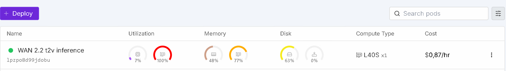

# 🚀 Run WAN 2.x with ComfyUI with provisioning — [RunPod.io Deployment](https://runpod.io?ref=se4tkc5o)

[](https://hub.docker.com/r/ls250824/run-comfyui-wan)



A streamlined and automated environment for running **ComfyUI** with **WAN 2.x video models**, optimized for use on [RunPod.io](https://runpod.io?ref=se4tkc5o).

## 🔧 Features

- Automatic model and LoRA downloads via environment variables.
- Built-in **authentication** for:
  - ComfyUI
  - Code Server
  - Hugging Face API
  - CivitAI API
- Supports advanced workflows for **video generation** and **enhancement** using pre-installed custom nodes.
- Compatible with high-performance NVIDIA GPUs.

## Template Deployment

### Important notice

- All images are tested on Runpod.io (L40S).
- Don't use regions US-TX-3 and US-TX-4 as they offen fail to download or run the image (Pytorch CUDA).

### Runpod.io templates

[**👉 One-click Deploy on RunPod WAN 2.2 t2v (lightx2v)**](https://console.runpod.io/deploy?template=qvozvvb1xd&ref=se4tkc5o)

[**👉 One-click Deploy on RunPod WAN 2.2 i2v (lightx2v)**](https://console.runpod.io/deploy?template=moem21s8xb&ref=se4tkc5o)

[**👉 One-click Deploy on RunPod WAN 2.2 animate (lightx2v)**](https://console.runpod.io/deploy?template=tp7gj0khyo&ref=se4tkc5o)

[**👉 One-click Deploy on RunPod WAN 2.2 lightx2v Dyno**](https://console.runpod.io/deploy?template=hcgfvldif0&ref=se4tkc5o)

[**👉 One-click Deploy on RunPod WAN 2.2 v2v Lucy Edit**](https://console.runpod.io/deploy?template=kay3oq4rx7&ref=se4tkc5o)

### Workflows

- Open from ComfyUI's interface on the left
- View/Download from [Workflow examples](https://awesome-comfyui.rozenlaan.site/ComfyUI_workflows/)

## 💻 Hardware Requirements

### T2V-A14B or I2V-A14B (high/low) 

- precision fp16
- video settings 1024x768 122 frames

| Recommended GPU          | VRAM  | RAM   |
|--------------------------|-------|-------|
| L40S, RTX 6000 Ada       | 40 GB | 90GB  | 

### Animate

- precision fp16
- video settings 1024x768 77 chunks/Sampler

| Recommended GPU          | VRAM  | RAM   |
|--------------------------|-------|-------|
| L40S, RTX 6000 Ada       | 40 GB | 105GB | 

### Storage

| Component        | Minimum                  |
|------------------|--------------------------|
| Volume Storage   | 90GB (`/workspace`)      |
| Pod Storage      | 15GB                     |

## 🐳 Docker Images

### Base Images

- **PyTorch Runtime**  [](https://hub.docker.com/r/ls250824/pytorch-cuda-ubuntu-runtime)

- **ComfyUI Runtime**  [](https://hub.docker.com/r/ls250824/comfyui-runtime)

### Custom Image

```bash
docker pull ls250824/run-comfyui-wan:<version>
```

## ⚙️ Environment Variables

### ComfyUI Configuration

| Variable                   | Description                    |
|----------------------------|--------------------------------|
| `COMFYUI_EXTRA_ARGUMENTS`  | Additional arguments for ComfyUI CLI |


### Authentication Tokens

| Token Source   | Variable         | 
|----------------|------------------|
| Code Server    | `PASSWORD`       | 
| Hugging Face   | `HF_TOKEN`       | 
| CivitAI        | `CIVITAI_TOKEN`  | 

### Hugging Face Model Configuration

| Model Type        | Model                         | Safetensors/GGUF                               |
|-------------------|-------------------------------|-------------------------------------------| 
| Diffusion Model   | `HF_MODEL_DIFFUSION_MODELS[1-20]`          | `HF_MODEL_DIFFUSION_MODELS_FILENAME[1-20]`   |
| Checkpoints       | `HF_MODEL_CHECKPOINTS[1-20]`        | `HF_MODEL_CHECKPOINTS_FILENAME[1-20]`        |
| Text Encoders     | `HF_MODEL_TEXT_ENCODERS[1-20]` | `HF_MODEL_TEXT_ENCODERS_FILENAME[1-20]` |
| Clip Vision       | `HF_MODEL_CLIP_VISION[1-20]`        | `HF_MODEL_CLIP_VISION_FILENAME[1-20]` |
| Audio Encoders    | `HF_MODEL_AUDIO_ENCODERS[1-20]` | `HF_MODEL_AUDIO_ENCODERS_FILENAME[1-20]` |
| Model patches    | `HF_MODEL_PATCHES[1-20]` | `HF_MODEL_PATCHES_FILENAME[1-20]` |
| VAE               | `HF_MODEL_VAE[1-20]`                | `HF_MODEL_VAE_FILENAME[1-20]`                |
| Upscalers         | `HF_MODEL_UPSCALER[1-20]`      | `HF_MODEL_UPSCALER_PTH[1-20]`              |
| Loras          | `HF_MODEL_LORA[1-20]`          | `HF_MODEL_LORA_FILENAME[1-20]`          |
| VLM/mmproj    | `HF_MODEL_VL[1-20]`          | `HF_MODEL_VL_FILENAME[1-20]`          |
| SAM segmentation | `HF_MODEL_SAMS[1-20]`          | `HF_MODEL_SAMS_FILENAME[1-20]`          |

### CivitAI LORAs

| Variable                         | Description                      |
|----------------------------------|----------------------------------|
| `CIVITAI_MODEL_LORA_URL[1-50]`   | Direct download link for LoRAs |


### Workflows

| Variable         | Description                      |
|------------------|----------------------------------|
| `WORKFLOW[1-50]` |  download link (compressed or plain)  |

## 🌐 Network Services

| Service       | Port   | Access Type |
|---------------|--------|-------------|
| ComfyUI       | `8188` | Web         |
| Code Server   | `9000` | Web         |
| SSH/SCP       | `22`   | Terminal    |

## 📚 Tutorials & Resources

- [WAN Video Homepage](https://wan.video/)
- [Docs ComfyUI](https://docs.comfy.org)
- [Enhance a Video](https://oahzxl.github.io/Enhance_A_Video/)
- [AccVideo](https://github.com/aejion/AccVideo)
- [CausVid](https://github.com/tianweiy/CausVid)
- [NAG](https://chendaryen.github.io/NAG.github.io/)
- [FusionX LoRA](https://civitai.com/models/1681541?modelVersionId=1903277)
- [LightX2V](https://github.com/ModelTC/LightX2V)
- [Pusa-VidGen](https://github.com/Yaofang-Liu/Pusa-VidGen)
- [Animated preview](https://civitai.com/articles/12623/dont-just-guess-with-your-wan-gens-animated-previews-for-seed-hunting-guide-comfyui)
- [Tutorial s2v](https://www.kombitz.com/2025/09/02/how-to-use-wan-2-2-s2v-gguf-model-in-comfyui/)
- [Wan 2.2 animate](https://wan.video/blog/wan2.2-animate)
- [Wan 2.2 animate workflow](https://comfyui-wiki.com/en/tutorial/advanced/video/wan2.2/wan2-2-animate)
- [Samplers](https://websim.com/c/I0nMJ7gYtQqdjW7yD)
- [HuMo Website](https://phantom-video.github.io/HuMo/)
- [HuMo Github](https://github.com/Phantom-video/HuMo)
- [Example prompts](https://alidocs.dingtalk.com/i/nodes/EpGBa2Lm8aZxe5myC99MelA2WgN7R35y)

## 🧩 Pre-Installed Custom Nodes

### Interface

- [rgthree](https://github.com/rgthree/rgthree-comfy)  
- [Login](https://github.com/liusida/ComfyUI-Login)  
- [Manager](https://github.com/ltdrdata/ComfyUI-Manager)
- [KJNodes](https://github.com/kijai/ComfyUI-KJNodes)  
- [GGUF](https://github.com/city96/ComfyUI-GGUF)
- [ComfyMath](https://github.com/evanspearman/ComfyMath.git)
- [Resolution master](https://github.com/Azornes/Comfyui-Resolution-Master.git)
- [Lucy edit](https://github.com/DecartAI/Lucy-Edit-ComfyUI)
- [PG Nodes](https://github.com/GizmoR13/PG-Nodes)
- [ComfyUi-Scale-Image-to-Total-Pixels-Advanced](https://github.com/BigStationW/ComfyUi-Scale-Image-to-Total-Pixels-Advanced)

### Video/Upscale

- [Video Helper Suite](https://github.com/kosinkadink/ComfyUI-VideoHelperSuite)
- [Frame Interpolation](https://github.com/Fannovel16/ComfyUI-Frame-Interpolation)
- [VideoUpscale with Model](https://github.com/ShmuelRonen/ComfyUI-VideoUpscale_WithModel)
- [SD Upscale](https://github.com/ssitu/ComfyUI_UltimateSDUpscale)
- [VRgamedevgirl](https://github.com/vrgamegirl19/comfyui-vrgamedevgirl)
- [VideoStitcher](https://github.com/Kishor900/comfyui-wanv2v-video-stitcher)

### Controlnet

- [controlnet_aux](https://github.com/Fannovel16/comfyui_controlnet_aux)

### Flow

- [Power Flow](https://github.com/x3bits/ComfyUI-Power-Flow)

### Segmentation

- [Segment anything](https://github.com/kijai/ComfyUI-segment-anything-2)
- [RMBG](https://github.com/1038lab/ComfyUI-RMBG)
- [SecNodes](https://github.com/9nate-drake/Comfyui-SecNodes)

### Wan

- [WanVideoWrapper](https://github.com/kijai/ComfyUI-WanVideoWrapper)
- [StartEndFrame](https://github.com/Flow-two/ComfyUI-WanStartEndFramesNative)
- [iamccs](https://github.com/IAMCCS/IAMCCS-nodes)
- [Wan22FMLF](https://github.com/wallen0322/ComfyUI-Wan22FMLF)
- [PainterI2V](https://github.com/princepainter/ComfyUI-PainterI2V)
- [PainterLongVideo](https://github.com/princepainter/ComfyUI-PainterLongVideo)
- [PainterI2VforKJ](https://github.com/princepainter/ComfyUI-PainterI2VforKJ)

### Animate

- [WanAnimate Enhancer](https://github.com/wallen0322/ComfyUI-WanAnimate-Enhancer.git)

### Sampling

- [RES4LYF](https://github.com/ClownsharkBatwing/RES4LYF)
- [Noise](https://github.com/BlenderNeko/ComfyUI_Noise)
- [WanMoeKSampler](https://github.com/stduhpf/ComfyUI-WanMoeKSampler)
- [Was affine](https://github.com/WASasquatch/was_affine)
- [TripleKSampler](https://github.com/VraethrDalkr/ComfyUI-TripleKSampler)
- [WanMoEScheduler](https://github.com/cmeka/ComfyUI-WanMoEScheduler)

## 🧩 All possible Custom Nodes

- [Full List](https://awesome-comfyui.rozenlaan.site)

## 📦 Model Sources

- [Wan-Video Github](https://github.com/Wan-Video)
- [Wan-Video 2.2 Github](https://github.com/Wan-Video/Wan2.2)
- [Kijai](https://huggingface.co/Kijai/WanVideo_comfy)
- [Wan-AI Huggingface](https://huggingface.co/Wan-AI)  
- [WAN-VACE Github](https://github.com/ali-vilab/VACE)
- [FusionX Huggingface](https://huggingface.co/vrgamedevgirl84/Wan14BT2VFusioniX)
- [MoviiGen Huggingface](https://huggingface.co/ZuluVision/MoviiGen1.1)

## 📦 Manual setup guides:

### 2.2

- [t2v](provisioning/hf_wan22_t2v.md)
- [i2v](provisioning/hf_wan22_i2v.md)
- [s2v](provisioning/hf_wan22_s2v.md)
- [animate](provisioning/hf_wan22_animate.md)
- [loras](provisioning/hf_wan22_loras.md)
- [lucy edit](provisioning/hf_lucy_edit.md)

### 2.1

- [WAN](provisioning/hf_wan21.md)
- [HuMo](provisioning/hf_humo.md)
- [loras](provisioning/hf_wan21_loras.md)

### Others

- [Segmentation](provisioning/hf_segmentation.md)
- [Upscale](provisioning/hf_upscale.md)

## ⚙️ Setup

| Component | Version              |
|-----------|----------------------|
| OS        | `Ubuntu 22.04 x86_64` |
| Python    | `3.11.x`             |
| PyTorch   | `2.9.0`              |
| CUDA      | `12.8.0`             |
| Triton    | `3.5.0`              |
| onnxruntime-gpu | `1.22.x` |
| ComfyUI | `0.3.68`  | 
| CodeServer | Latest |

## ⚙️ Installed Attentions

### Wheels

| Package        | Version  |
|----------------|----------|
| flash_attn     | 2.8.3    |
| sageattention  | 2.2.0    |

### Build for

| Processor | Compute Capability | SM |
|------------|-----------------|-----------|
| A40  | 8.6 | sm_86
| L40S | 8.9 | sm_89

## 🛠️ Build & Push Docker Image (Optional)

Use none docker setup to build the image using the included Python script.

### Build Script: `build-docker.py`

| Argument       | Description                        | Default          |
|----------------|------------------------------------|------------------|
| `--username`   | Your Docker Hub username           | Current user     |
| `--tag`        | Custom image tag                   | Today's date     |
| `--latest`     | Also tag image as `latest`         | Disabled         |

### Example Usage

```bash
git clone https://github.com/jalberty2018/run-comfyui-wan.git
cp ./run-comfyui-wan/build-docker.py ..

export DOCKER_BUILDKIT=1
export COMPOSE_DOCKER_CLI_BUILD=1

python3 build-docker.py   --username=<your_dockerhub_username>   --tag=<custom_tag>   --latest   run-comfyui-wan
```